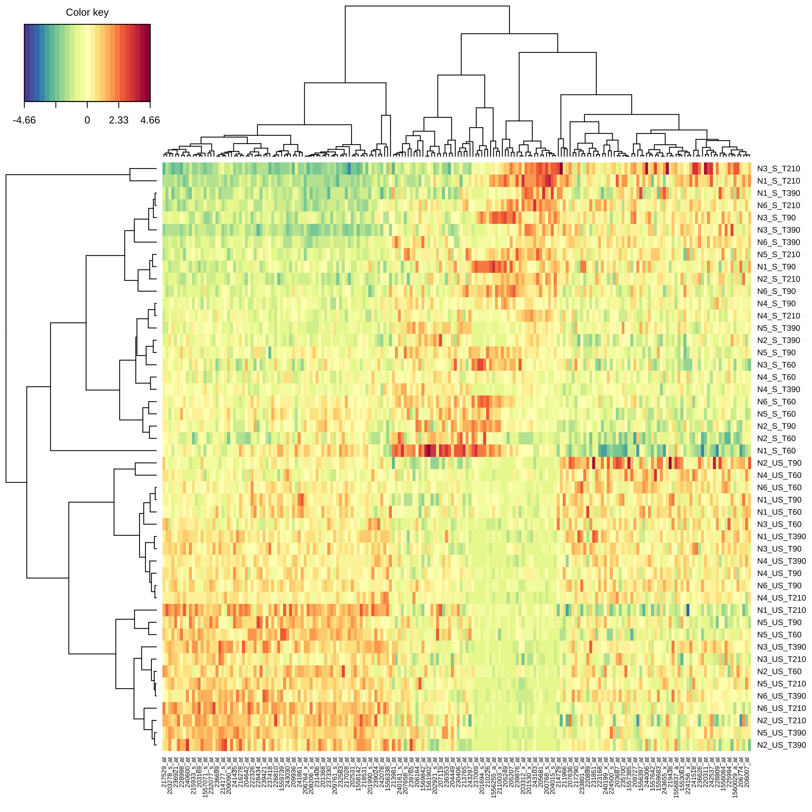
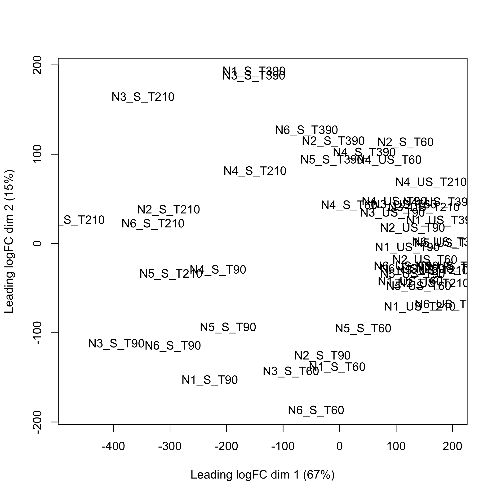
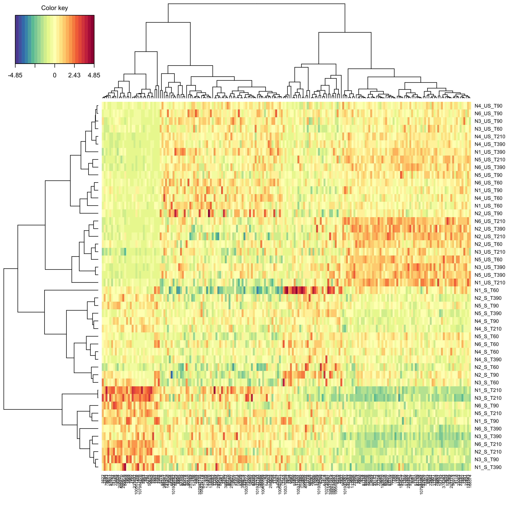
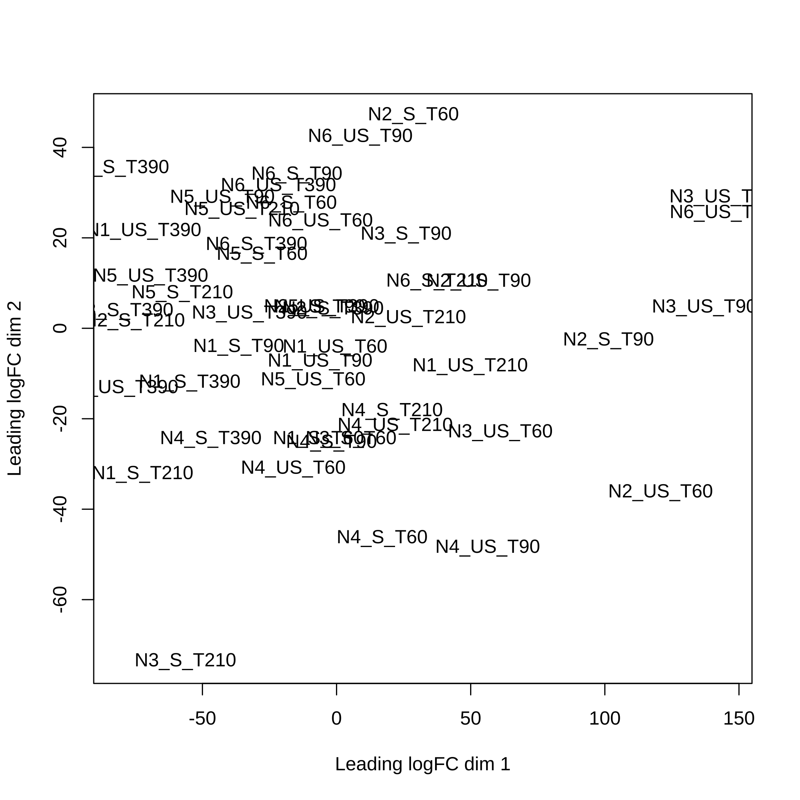

[](https://cran.r-project.org/package=CascadeData)
[](https://zenodo.org/badge/latestdoi/167803258)

<!-- README.md is generated from README.Rmd. Please edit that file -->


# CascadeData

The goal of CascadeData is to provide the experimental data [GSE39411](https://www.ncbi.nlm.nih.gov/geo/query/acc.cgi?acc=GSE39411) in a ready to use format. Vallat L, Kemper CA, Jung N, Maumy-Bertrand M, Bertrand F, ..., Bahram S, (2013), "Reverse-engineering the genetic circuitry of a cancer cell with predicted intervention in chronic lymphocytic leukemia". *Proc Natl Acad Sci USA*, **110**(2):459-64, <https://dx.doi.org/10.1073/pnas.1211130110>.

These are featured as examples by packages such as the Cascade one, a modeling tool allowing gene selection, reverse engineering, and prediction in cascade networks. (Jung, N., Bertrand, F., Bahram, S., Vallat, L., and Maumy-Bertrand, M., 2014, <http://dx.doi.org/10.1093/bioinformatics/btt705>).

This website and these examples were created by F. Bertrand and M. Maumy-Bertrand.


## Installation

You can install the released version of CascadeData from [CRAN](https://CRAN.R-project.org) with:


```r
install.packages("CascadeData")
```

You can install the development version of CascadeData from [github](https://github.com) with:


```r
devtools::install_github("fbertran/CascadeData")
```
## Examples

### Probesets
Two data frames with 54613 probesets with repeated measurements on 6 independent subjects at 4 time points.


```r
data(micro_S)
str(micro_S)
#> 'data.frame':	54613 obs. of  24 variables:
#>  $ N1_S_T60 : num  136.1 32 78 201.8 16.3 ...
#>  $ N1_S_T90 : num  116.6 43.3 63.5 209.2 8 ...
#>  $ N1_S_T210: num  127.6 31.3 57.9 208.8 15.8 ...
#>  $ N1_S_T390: num  126.8 43.8 73.2 228.2 15.8 ...
#>  $ N2_S_T60 : num  142.2 25.4 53.2 165.3 17.8 ...
#>  $ N2_S_T90 : num  132.5 35.4 97.1 222.3 10.7 ...
#>  $ N2_S_T210: num  122.8 33.3 66.5 175.4 12.9 ...
#>  $ N2_S_T390: num  132.1 55.7 69.7 178.5 13.9 ...
#>  $ N3_S_T60 : num  134 60 52.1 214.6 6.6 ...
#>  $ N3_S_T90 : num  157.1 48.7 59.9 279.5 3.7 ...
#>  $ N3_S_T210: num  49.1 45.7 44.1 181.2 1.3 ...
#>  $ N3_S_T390: num  139.8 41.4 51.8 264.9 19.5 ...
#>  $ N4_S_T60 : num  157.4 66.8 74 214.1 26.1 ...
#>  $ N4_S_T90 : num  158.3 44.8 56.8 222.7 17.9 ...
#>  $ N4_S_T210: num  145.9 42.5 59.8 221.8 18.5 ...
#>  $ N4_S_T390: num  171.2 59.2 62.3 193.3 25.1 ...
#>  $ N5_S_T60 : num  130.1 60.8 63.8 208.5 18.6 ...
#>  $ N5_S_T90 : num  119.7 41.8 47.2 222.8 26.9 ...
#>  $ N5_S_T210: num  121.3 40.5 62.7 226 21.5 ...
#>  $ N5_S_T390: num  110 44 63 227.8 27.2 ...
#>  $ N6_S_T60 : num  114.5 60.7 79.5 219.4 22.1 ...
#>  $ N6_S_T90 : num  144 38.9 79.4 234.8 28.4 ...
#>  $ N6_S_T210: num  128.4 38.7 63.4 241.9 30.5 ...
#>  $ N6_S_T390: num  132.7 52.3 66.6 218.7 19.2 ...
```


```r
data(micro_US)
str(micro_US)
#> 'data.frame':	54613 obs. of  24 variables:
#>  $ N1_US_T60 : num  103.2 26 70.7 213.7 13.7 ...
#>  $ N1_US_T90 : num  133.7 34.9 71.2 168.9 17.2 ...
#>  $ N1_US_T210: num  157.3 44.2 59.4 175.1 27.8 ...
#>  $ N1_US_T390: num  179.4 44.1 62.7 225.1 10.5 ...
#>  $ N2_US_T60 : num  120.7 47.4 85.8 156.7 16.7 ...
#>  $ N2_US_T90 : num  150.5 40.4 74.4 200.4 25.8 ...
#>  $ N2_US_T210: num  153.5 51.8 71.7 181.6 23 ...
#>  $ N2_US_T390: num  174.8 61.6 66.8 224.5 12.2 ...
#>  $ N3_US_T60 : num  145 64.5 50.8 184.5 17.5 ...
#>  $ N3_US_T90 : num  162.2 58.7 51.9 219.1 21.5 ...
#>  $ N3_US_T210: num  177.8 35.9 58.3 250 12.7 ...
#>  $ N3_US_T390: num  189.6 50.5 62.8 262 20.1 ...
#>  $ N4_US_T60 : num  136 60.9 67.8 227.1 29.6 ...
#>  $ N4_US_T90 : num  135.2 62.2 65.3 221.1 18.2 ...
#>  $ N4_US_T210: num  165.3 62.7 63.3 212.1 21.4 ...
#>  $ N4_US_T390: num  154.3 47.1 68.9 199.7 9.3 ...
#>  $ N5_US_T60 : num  130.9 57.5 56.5 199 20.5 ...
#>  $ N5_US_T90 : num  122.3 49.4 62 226.8 15.4 ...
#>  $ N5_US_T210: num  184.8 57.2 53.4 191.2 18.1 ...
#>  $ N5_US_T390: num  174.6 68 69.1 214 16.5 ...
#>  $ N6_US_T60 : num  142.8 67.9 73.3 220.1 24.7 ...
#>  $ N6_US_T90 : num  148.1 46.4 79.9 257.7 20.7 ...
#>  $ N6_US_T210: num  198.1 53.9 68.6 223.3 18.9 ...
#>  $ N6_US_T390: num  155.8 42.6 63.2 236.7 15.2 ...
```

Some preliminary between group comparison. First create grouping factor.

```r
groupf=factor(c(rep("S",ncol(micro_S)),rep("US",ncol(micro_US))))
```

Then, create the 2 most discriminative components (probeset linear combinaison, i.e. scores) featuring 100 probesets each using sparse partial least squares discrimant analysis from the [mixOmics](https://www.bioconductor.org/packages/release/bioc/html/mixOmics.html) package, [https://doi.org/doi:10.18129/B9.bioc.mixOmics](doi:10.18129/B9.bioc.mixOmics). An optimal choice of the number of components and of the number of kept genes can be carried out using cross-validation.

First makes sure that the mixOmics Bioconductor package is installed.

```r
if (!requireNamespace("limma", quietly = TRUE)){
  if (!requireNamespace("BiocManager", quietly = TRUE)){
    install.packages("BiocManager")
    }
  BiocManager::install("limma")
}
```


```r
modsplsda=mixOmics::splsda(t(cbind(micro_S,micro_US)),groupf, ncomp = 2, 
keepX = c(100, 100))
```

Create a clustered image map (cim, i.e. heat map) to represent the results of the splsda analysis.


```r
mixOmics::cim(modsplsda)
```



Retrieve the names of the probesets that were selected to create the 2 splsda components


```r
selectedprobesets<-unique(mixOmics::selectVar(modsplsda)$name,
mixOmics::selectVar(modsplsda, comp=2)$name)
```

First makes sure that the limma Bioconductor package is installed.

```r
if (!requireNamespace("limma", quietly = TRUE)){
  if (!requireNamespace("BiocManager", quietly = TRUE)){
    install.packages("BiocManager")
    }
  BiocManager::install("limma")
}
```

Using the [limma](http://bioconductor.org/packages/release/bioc/html/limma.html), [https://doi.org/doi:10.18129/B9.bioc.limma](doi:10.18129/B9.bioc.limma), plotMDS function to create the multidimensional scaling plot of distances between the probeset expression profiles that were selected using splsda.

```r
limma::plotMDS(cbind(micro_S,micro_US)[selectedprobesets,])
```



### Entrez GeneIDs

The [jetset](https://cran.r-project.org/package=jetset) package enables the selection of optimal probe sets from the HG-U95Av2, HG-U133A, HG-U133 Plus 2.0, or U133 X3P microarray platforms. It requires the [org.Hs.eg.db](https://bioconductor.org/packages/release/data/annotation/html/org.Hs.eg.db.html) Bioconductor package, [https://doi.org/doi:10.18129/B9.bioc.org.Hs.eg.db](doi:10.18129/B9.bioc.org.Hs.eg.db).


First makes sure that the jetset CRAN package and the org.Hs.eg.db Bioconductor package are installed.

```r
if (!requireNamespace("org.Hs.eg.db", quietly = TRUE)){
  if (!requireNamespace("BiocManager", quietly = TRUE)){
      install.packages("BiocManager")
    }
  BiocManager::install("org.Hs.eg.db", version = "3.8")
}
#> 
if (!requireNamespace("jetset", quietly = TRUE)){
  install.packages("jetset")
}
```

Retrieve the optimal probesets for a given Entrez GeneID.

```r
library(jetset)
resjetset=jetset::jmap("hgu133plus2", eg = sort(unique(scores.hgu133plus2$EntrezID)))
```

Select the optimal probesets from the datasets for a given Entrez GeneID.

```r
micro_S_jetset<-micro_S[resjetset,]
rownames(micro_S_jetset)<-names(resjetset)
micro_US_jetset<-micro_US[resjetset,]
rownames(micro_US_jetset)<-names(resjetset)
```

Then, create the 2 most discriminative components (probeset linear combinaison, i.e. scores) featuring 100 probesets each using sparse partial least squares discrimant analysis from the [mixOmics](https://www.bioconductor.org/packages/release/bioc/html/mixOmics.html) package, [https://doi.org/doi:10.18129/B9.bioc.mixOmics](doi:10.18129/B9.bioc.mixOmics). An optimal choice of the number of components and of the number of kept genes can be carried out using cross-validation.

First makes sure that the mixOmics Bioconductor package is installed.

```r
modsplsda_jetset=mixOmics::splsda(t(cbind(micro_S_jetset,micro_US_jetset)), 
groupf, ncomp = 2, keepX = c(100, 100))
```

Create a clustered image map (cim, i.e. heat map) to represent the results of the splsda analysis.


```r
mixOmics::cim(modsplsda_jetset)
```



Retrieve the Entrez GeneIDs that were selected to create the 2 splsda components


```r
selectedEntrezGeneIDs<-unique(mixOmics::selectVar(modsplsda_jetset)$name,
mixOmics::selectVar(modsplsda, comp=2)$name)
```

First makes sure that the limma Bioconductor package is installed.

```r
if (!requireNamespace("limma", quietly = TRUE)){
  if (!requireNamespace("BiocManager", quietly = TRUE)){
    install.packages("BiocManager")
    }
  BiocManager::install("limma")
}
```

Using the [limma](http://bioconductor.org/packages/release/bioc/html/limma.html), [https://doi.org/doi:10.18129/B9.bioc.limma](doi:10.18129/B9.bioc.limma), plotMDS function to create the multidimensional scaling plot of distances between the Entrez GeneID expression profiles that were selected using splsda.

```r
limma::plotMDS(cbind(micro_S,micro_US)[selectedEntrezGeneIDs,])
```



