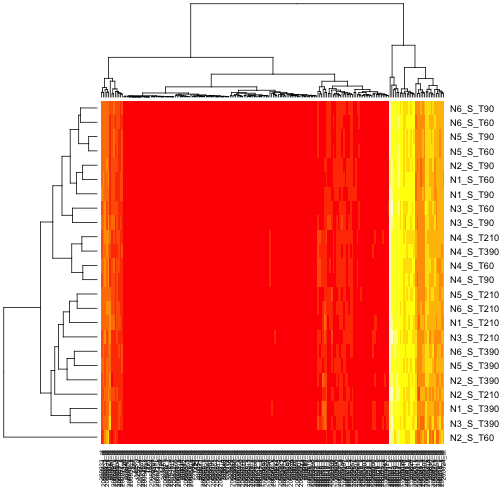
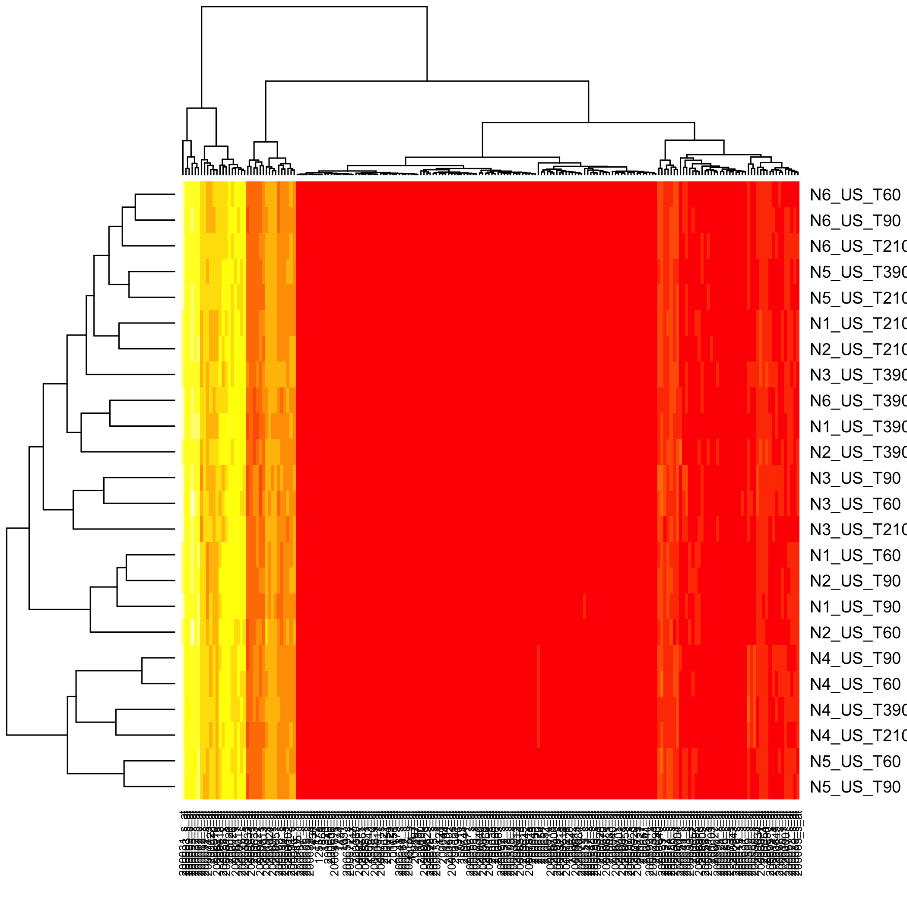

[](https://cran.r-project.org/package=CascadeData)

<!-- README.md is generated from README.Rmd. Please edit that file -->


# CascadeData

The goal of CascadeData is to provide experimental data that are used as examples by packages such as the Cascade one, a modeling tool allowing gene selection, reverse engineering, and prediction in cascade networks. (Jung, N., Bertrand, F., Bahram, S., Vallat, L., and Maumy-Bertrand, M., 2014, <doi:10.1093/bioinformatics/btt705>).

## Installation

You can install the released version of CascadeData from [CRAN](https://CRAN.R-project.org) with:

``` r
install.packages("CascadeData")
```

## Example

Two data frames with 54613 probesets measured 6 times throught 4 time points.


```r
data(micro_S)
str(micro_S)
#> 'data.frame':	54613 obs. of  24 variables:
#>  $ N1_S_T60 : num  136.1 32 78 201.8 16.3 ...
#>  $ N1_S_T90 : num  116.6 43.3 63.5 209.2 8 ...
#>  $ N1_S_T210: num  127.6 31.3 57.9 208.8 15.8 ...
#>  $ N1_S_T390: num  126.8 43.8 73.2 228.2 15.8 ...
#>  $ N2_S_T60 : num  142.2 25.4 53.2 165.3 17.8 ...
#>  $ N2_S_T90 : num  132.5 35.4 97.1 222.3 10.7 ...
#>  $ N2_S_T210: num  122.8 33.3 66.5 175.4 12.9 ...
#>  $ N2_S_T390: num  132.1 55.7 69.7 178.5 13.9 ...
#>  $ N3_S_T60 : num  134 60 52.1 214.6 6.6 ...
#>  $ N3_S_T90 : num  157.1 48.7 59.9 279.5 3.7 ...
#>  $ N3_S_T210: num  49.1 45.7 44.1 181.2 1.3 ...
#>  $ N3_S_T390: num  139.8 41.4 51.8 264.9 19.5 ...
#>  $ N4_S_T60 : num  157.4 66.8 74 214.1 26.1 ...
#>  $ N4_S_T90 : num  158.3 44.8 56.8 222.7 17.9 ...
#>  $ N4_S_T210: num  145.9 42.5 59.8 221.8 18.5 ...
#>  $ N4_S_T390: num  171.2 59.2 62.3 193.3 25.1 ...
#>  $ N5_S_T60 : num  130.1 60.8 63.8 208.5 18.6 ...
#>  $ N5_S_T90 : num  119.7 41.8 47.2 222.8 26.9 ...
#>  $ N5_S_T210: num  121.3 40.5 62.7 226 21.5 ...
#>  $ N5_S_T390: num  110 44 63 227.8 27.2 ...
#>  $ N6_S_T60 : num  114.5 60.7 79.5 219.4 22.1 ...
#>  $ N6_S_T90 : num  144 38.9 79.4 234.8 28.4 ...
#>  $ N6_S_T210: num  128.4 38.7 63.4 241.9 30.5 ...
#>  $ N6_S_T390: num  132.7 52.3 66.6 218.7 19.2 ...
```


```r
data(micro_US)
str(micro_US)
#> 'data.frame':	54613 obs. of  24 variables:
#>  $ N1_US_T60 : num  103.2 26 70.7 213.7 13.7 ...
#>  $ N1_US_T90 : num  133.7 34.9 71.2 168.9 17.2 ...
#>  $ N1_US_T210: num  157.3 44.2 59.4 175.1 27.8 ...
#>  $ N1_US_T390: num  179.4 44.1 62.7 225.1 10.5 ...
#>  $ N2_US_T60 : num  120.7 47.4 85.8 156.7 16.7 ...
#>  $ N2_US_T90 : num  150.5 40.4 74.4 200.4 25.8 ...
#>  $ N2_US_T210: num  153.5 51.8 71.7 181.6 23 ...
#>  $ N2_US_T390: num  174.8 61.6 66.8 224.5 12.2 ...
#>  $ N3_US_T60 : num  145 64.5 50.8 184.5 17.5 ...
#>  $ N3_US_T90 : num  162.2 58.7 51.9 219.1 21.5 ...
#>  $ N3_US_T210: num  177.8 35.9 58.3 250 12.7 ...
#>  $ N3_US_T390: num  189.6 50.5 62.8 262 20.1 ...
#>  $ N4_US_T60 : num  136 60.9 67.8 227.1 29.6 ...
#>  $ N4_US_T90 : num  135.2 62.2 65.3 221.1 18.2 ...
#>  $ N4_US_T210: num  165.3 62.7 63.3 212.1 21.4 ...
#>  $ N4_US_T390: num  154.3 47.1 68.9 199.7 9.3 ...
#>  $ N5_US_T60 : num  130.9 57.5 56.5 199 20.5 ...
#>  $ N5_US_T90 : num  122.3 49.4 62 226.8 15.4 ...
#>  $ N5_US_T210: num  184.8 57.2 53.4 191.2 18.1 ...
#>  $ N5_US_T390: num  174.6 68 69.1 214 16.5 ...
#>  $ N6_US_T60 : num  142.8 67.9 73.3 220.1 24.7 ...
#>  $ N6_US_T90 : num  148.1 46.4 79.9 257.7 20.7 ...
#>  $ N6_US_T210: num  198.1 53.9 68.6 223.3 18.9 ...
#>  $ N6_US_T390: num  155.8 42.6 63.2 236.7 15.2 ...
```

You can also embed plots, for example:





